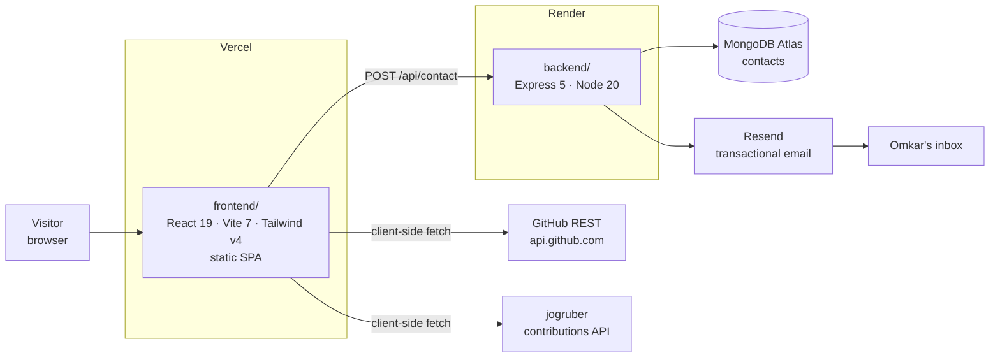
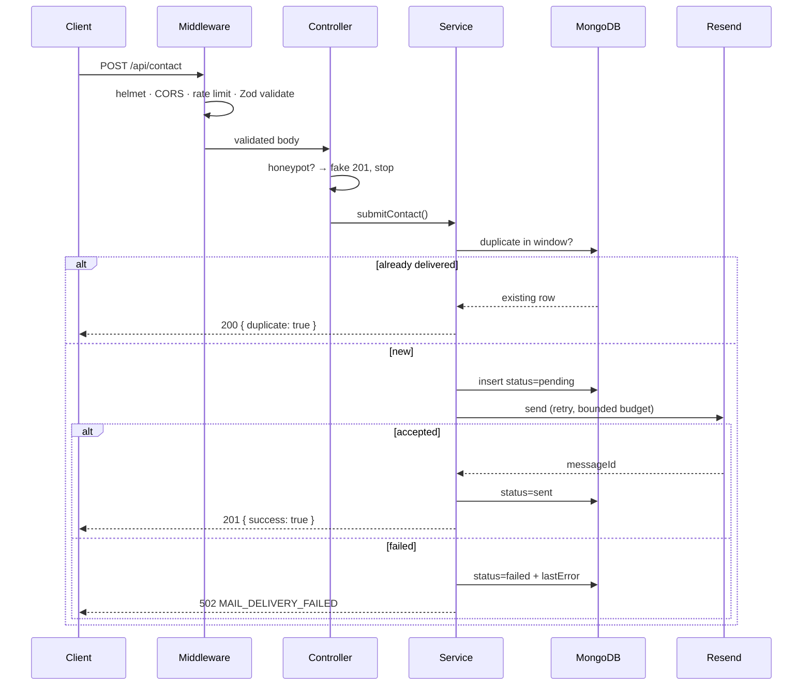

# Architecture

[← Index](./README.md)

## System



Two independent deployments. The frontend is fully static — no SSR, no server
runtime. Its only backend dependency is the contact form; every other section
renders from local data or hits a public API straight from the browser.

## Contact request flow

The one non-trivial path in the system. A `2xx` is returned **only** after a
mail provider has accepted the message.



Two dedupe layers: a fast read on `dedupeHash`, and a **unique index** on
`dedupeKey` (`sha256(email+message)` bucketed by the dedupe window) that makes
concurrent identical submissions race-safe — MongoDB rejects the second with
`E11000` rather than the app doing check-then-insert.

## Repository layout

```
PORTFOLIO/
├── frontend/          React SPA — the portfolio          → Vercel
├── backend/           Express contact API (own git repo) → Render
├── web/               Abandoned Next.js rebuild — does not build
├── docs/              This documentation
└── .claude/           launch.json — dev server configs for tooling
```

There is **no root `package.json`** and no workspace/monorepo tooling. Each app
is installed and run independently.

## Layer boundaries

**Frontend** — `sections/` compose `components/`, which read from `data/`.
Components never contain content; data files never contain markup. See
[frontend.md](./frontend.md).

**Backend** — strict one-way dependency:

```
routes → controllers → services → repositories → models
```

Controllers do HTTP only. Services own the use case. Repositories are the only
code that touches Mongoose, which keeps services testable against a stub and
confines a future storage change to one directory. See
[backend.md](./backend.md).
