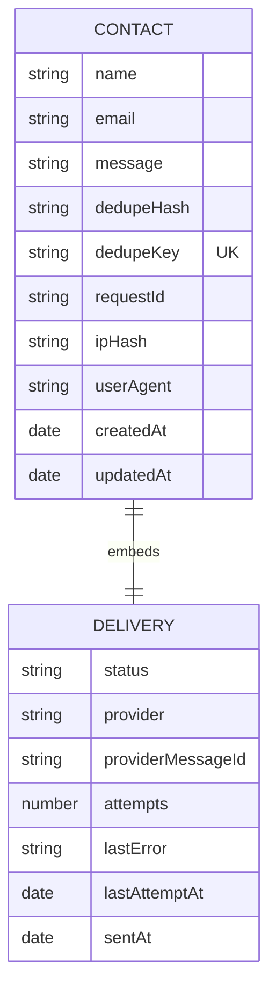

# Backend

[← Index](./README.md) · [Endpoint reference →](./api.md)

Node ≥20 · Express 5 · Mongoose 9 · Zod · Resend. ESM throughout
(`"type": "module"`). One feature: the contact form.

## Layers

```
routes/ ──▶ controllers/ ──▶ services/ ──▶ repositories/ ──▶ models/
              │                  │
         middleware/         services/mail/
```

Dependencies point one way. Controllers do HTTP only; services own the use
case; repositories are the only modules importing Mongoose.

```
src/
├── app.js              Express wiring — no listen(), no DB
├── server.js           Process lifecycle
├── config/             env.js (Zod-validated) · db.js
├── routes/             index · health · contact
├── controllers/        contact · health
├── services/           contact.service.js · mail/
├── repositories/       contact.repository.js
├── models/             Contact.js
├── middleware/         requestContext · rateLimiters · validate · notFound · errorHandler
├── validators/         contact.validator.js
└── utils/              AppError · asyncHandler · logger · retry · withTimeout
```

**`app.js` has no `listen()` or `connect()`** — that is what lets supertest
import it without opening a port or touching Atlas. `server.js` owns the
lifecycle: connect, verify mail credentials at boot, listen, then drain on
`SIGTERM` (Render sends one on every deploy) before closing the database.

## Configuration

`config/env.js` is the single source of truth and **must be imported first** by
anything reading config — importing it runs `dotenv` as a side effect before its
own body executes. Modules read a frozen `env` object, never `process.env`.

Invalid config crashes at boot with a readable report. In production the app
refuses to start if `ALLOWED_ORIGINS` is empty or `IP_HASH_SALT` is still the
placeholder.

Full variable list with defaults: `backend/.env.example`. Deployment values:
[deployment.md](./deployment.md).

## Data model

One collection, `contacts`:



`delivery.status` is `pending | sent | failed`. The row is the durable record of
intent; `delivery` records what happened to it, so a failed send is a queryable
row rather than a lost message.

**Indexes** — `email`, `dedupeHash`, `delivery.status`, compound
`{dedupeHash, createdAt}` and `{delivery.status, createdAt}`, and a **unique
sparse** index on `dedupeKey`. Sparse matters for migration: rows from the
previous version have no `dedupeKey`, and a plain unique index would refuse to
build against more than one of them.

IP addresses are stored only as a salted SHA-256 prefix — never raw.

## Mail

`services/mail/` — Resend is primary; SMTP exists as an opt-in fallback
(`MAIL_FALLBACK_ENABLED=true`). `sendContactNotification` resolves **only** when
a provider returns an id, which is what makes "never report success unless it
happened" enforceable upstream.

Each attempt has a network timeout (`MAIL_TIMEOUT_MS`) inside a total
wall-clock budget (`MAIL_TOTAL_BUDGET_MS`), retried on transient failures only,
with the contact's `dedupeKey` passed as an idempotency key so a retried
ambiguous send cannot duplicate.

## Errors

`middleware/errorHandler.js` is the only place an error becomes a response.
`AppError` is trusted and exposed; known infrastructure errors map to honest
statuses — 503 when Mongo is unreachable, 400 for malformed JSON, 409 on
`E11000` — and anything else logs a full stack but returns a generic 500.
Response shape is always `{ success, message, code, requestId }`.

## Not implemented

- No authentication or admin UI — submissions are read directly in Atlas.
- No retry worker. `findUndelivered()` exists for one, but nothing calls it;
  failed deliveries need manual attention.
- Rate limiting is **in-memory**: per-instance and reset on every deploy. A
  speed bump against volumetric spam, not a hard quota. The durable protection
  is the unique-index dedupe.
- No linter configured in `backend/` (there is one in `frontend/`).
