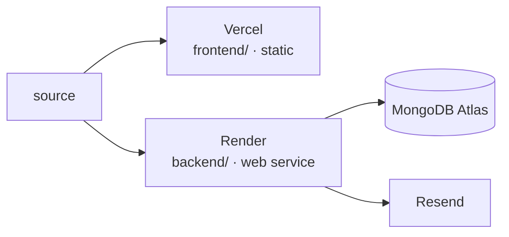

# Deployment

[← Index](./README.md)



## Frontend → Vercel

Static output, no server runtime.

| Setting | Value |
|---|---|
| Root directory | `frontend` |
| Build command | `npm run build` |
| Output directory | `dist` |
| Install command | `npm ci` |

Vercel Analytics needs no key — `<Analytics />` is already rendered in
`App.jsx`, and the insights script only resolves once deployed there.

An SPA rewrite (all paths → `/index.html`) is only needed if client-side
routing is ever added. Today the site is a single page with anchors.

## Backend → Render

`backend/render.yaml` is a committed Render blueprint, so the service config is
reviewable rather than clicked into a dashboard:

| Setting | Value |
|---|---|
| Root directory | `backend` |
| Build | `npm ci` |
| Start | `npm start` |
| Health check | `/healthz` (liveness — **not** `/readyz`) |
| Plan | `starter` |
| Region | `oregon` |

Secrets are declared `sync: false`, so Render prompts once and nothing is
committed: `MONGO_URI`, `RESEND_API_KEY`, `IP_HASH_SALT`.

Set `ALLOWED_ORIGINS` to the deployed frontend origin. The app **refuses to
boot** in production with it empty, or with `IP_HASH_SALT` left as the
placeholder — misconfiguration fails at deploy time, not at 2am on a real
message.

Free/starter instances sleep. The first message after idle waits on a cold
start; the frontend shows the pending state while that happens.

## MongoDB Atlas

One database, one `contacts` collection. Indexes are declared in the Mongoose
schema and created on connect — no migration step.

Allow Render's egress in the Atlas IP access list. A blocked IP surfaces as
`503 DB_UNAVAILABLE`, and `serverSelectionTimeoutMS` is set explicitly so it
fails fast rather than hanging 30 s per query.

## Resend

`MAIL_FROM` must be on a domain verified in Resend. Until a domain is verified,
the sandbox sender `onboarding@resend.dev` works but **only delivers to the
address that owns the Resend account**.

Verify credentials after deploy:

```bash
npm --prefix backend run mail:smoke
```

`server.js` also verifies providers at boot, so a rotated key shows up in the
deploy log rather than in a message that never arrives.

## Post-deploy checks

```bash
curl https://<backend>/healthz
curl https://<backend>/readyz
```

Then submit the real contact form once and confirm the email lands and the
`contacts` row shows `delivery.status: "sent"`.

## Before going live

Replace the placeholder domain `https://omkargavade.dev/` in four places:
`frontend/index.html` (canonical **and** `og:url`), `frontend/public/robots.txt`,
`frontend/public/sitemap.xml`. A wrong canonical tells search engines the wrong
page is authoritative.

## Not deployed

`web/` has no deployment and does not build. See
[reference.md](./reference.md#the-web-directory).
